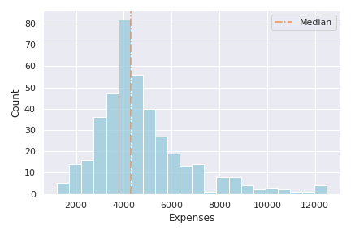
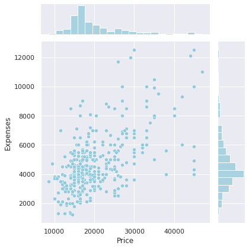
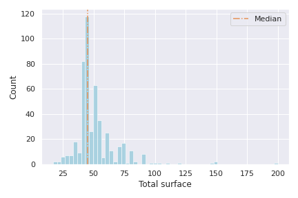
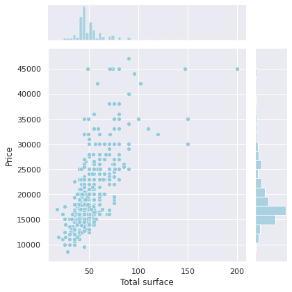
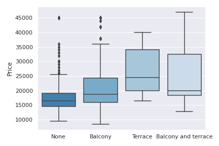
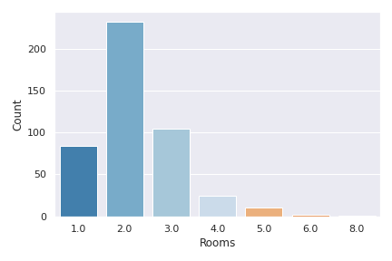
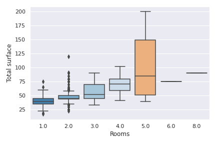
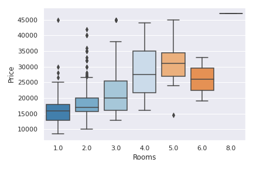
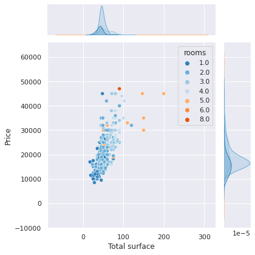

# Rentals report

Some rentals statistics in [**Nueva Córdoba, Córdoba, Argentina.**](https://goo.gl/maps/nYE87CUEyFGnZf8z9)

> Last updated: **2021-06-04**

## Prices distribution

## Expenses distribution

## Prices and expenses relation

## Total surface distribution

## Total surface and price relation

## Prices depending on balcony and terrace

## Number of rooms

## Total surface per number of rooms

## Price per number of rooms

## Total surface and price relation with number of rooms

